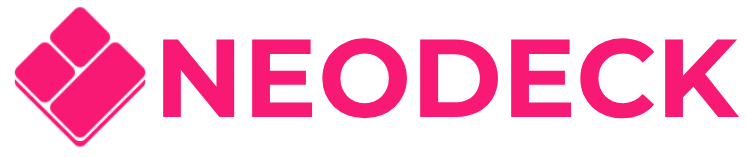
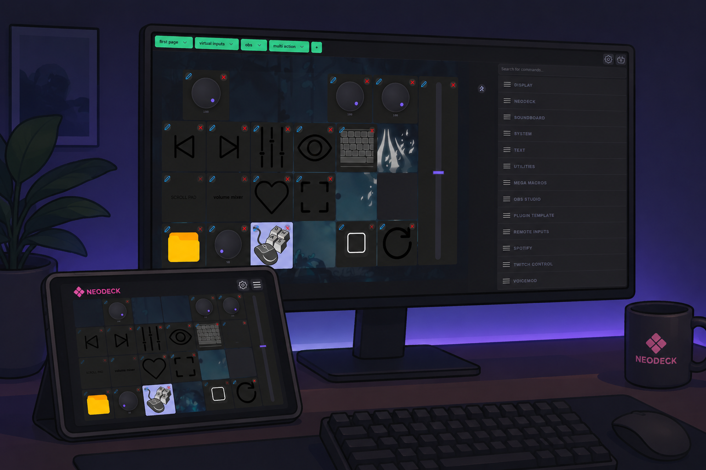

# NeoDeck


A modern remote control dashboard inspired by the original [WebDeck](https://github.com/Lenochxd/WebDeck) project.

NeoDeck allows you to control your computer from any device with a browser — using customizable buttons, sliders, folders, multi-actions, plugins, and dynamic actions.

Built with Python, Flask, JavaScript, and a plugin-based architecture.

* * *

## ✨ Features

* 📱 Remote control from any browser
* 🎛️ Dynamic buttons, sliders, and multi-actions
* 📂 Folder and page organization
* 🔌 Plugin system
* 🌍 Internationalization (i18n)
* 🖼️ External/custom images
* ⚙️ Improved settings system
* 🧩 Modularized and refactored codebase
* 🚀 Portable Windows builds
* 🔍 Improved search and UI workflows
* 🛠️ Tray integration and startup options

* * *

## 📸 Preview




* * *

## 📦 Installation

### Windows

1. Download the latest release from the releases page.
2. Extract the portable archive.
3. Run `NeoDeck.exe`
4. Open the displayed local URL or scan the QR code.

* * *

## 🔧 Development

Clone the repository:

```Bash
git clone https://github.com/Dalinnar/NeoDeck.git
cd NeoDeck
```

Create a virtual environment:

```Bash
python -m venv venv
```

Activate it:

### Windows

```Bash
venv\Scripts\activate
```

### Linux/macOS

```Bash
source venv/bin/activate
```

Install dependencies:

```Bash
pip install -r requirements.txt
```

Run the application:

```Bash
python run.py
```
build the aplication:

```Bash
python setup.py build_exe
```
* * *

## 🧩 Plugins

NeoDeck supports plugins and modular actions.

Plugin architecture has been heavily reworked compared to the original project, with improvements to:

* Settings handling
* Dynamic imports
* Action structures
* Input systems
* Plugin isolation
* UI integration
* * *

## 🛠️ Project Status

This project started as a fork of [WebDeck](https://github.com/Lenochxd/WebDeck) but has since been substantially rewritten and restructured.

Major changes include:

* Large frontend refactors
* Modular architecture improvements
* New settings system
* Plugin system redesign
* Multi-action support
* Translation improvements
* UI/UX improvements
* Launcher and packaging changes
* Internal cleanup and code splitting

* * *

## 📜 License

NeoDeck is licensed under the GNU General Public License v3.0.

This project contains and builds upon code originally from:

* [WebDeck by Lenochxd](https://github.com/Lenochxd/WebDeck)

See the LICENSE file for more information.

* * *

## ❤️ Credits

Original project:

* Lenoch — creator of WebDeck

Fork and rewrite:

* Dalinnar

* * *

## 📄 GPL Notice

This program is free software: you can redistribute it and/or modify it under the terms of the GNU General Public License as published by the Free Software Foundation, either version 3 of the License, or (at your option) any later version.

This program is distributed in the hope that it will be useful, but WITHOUT ANY WARRANTY.

For details, see the LICENSE file or visit:

[GNU GPL v3 License](https://www.gnu.org/licenses/gpl-3.0.en.html)